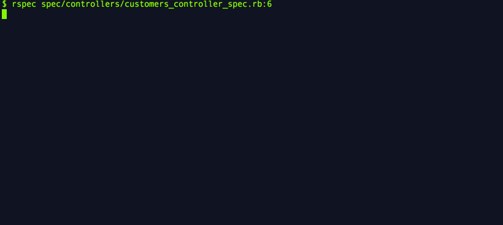

# WhinyValidation

Your spec fails and you don't know why. You look at the log,
but it doesn't give you any clues. You waste 15 minutes trying
to figure it out.

WhinyValidation to the rescue.

When an ActiveRecord model won't save because it's invalid,
this gem writes the validation error messages to the log.

The log shows all the attributes of the ActiveRecord object
that failed, along with the error message.

Validation errors are shown in an attractive yellow, which
stands out nicely if your terminal background is dark.

It can be useful in development and especially in test mode,
to understand why a model didn't save.

[Read more in this blog
post on I Like Stuff.](http://ilikestuffblog.com/2014/04/09/whiny-validation/)



## Compatibility

Ruby 1.9.3 and above.

Rails 3.2 and above.

## Installation

Add this line to your application's Gemfile:

    gem 'whiny_validation'

And then execute:

    $ bundle

Or install it yourself as:

    $ gem install whiny_validation

## Usage

When a model didn't save but you expected it to save, look in the
log for "Validation failed."

## Configuration

By default, the gem uses debug-level logging, so any Rails environment
with debug-level logging will include the whiny validation messages.

You can change the log level like so:

```ruby
# config/initializers/whiny_validation.rb
WhinyValidation.configure do |config|
  config.log_level = :info
end
```

## Tests

Quit your whining.

## Contributing

1. Fork it
2. Create your feature branch (`git checkout -b my-new-feature`)
3. Commit your changes (`git commit -am 'Added some feature'`)
4. Push to the branch (`git push origin my-new-feature`)
5. Create new Pull Request
